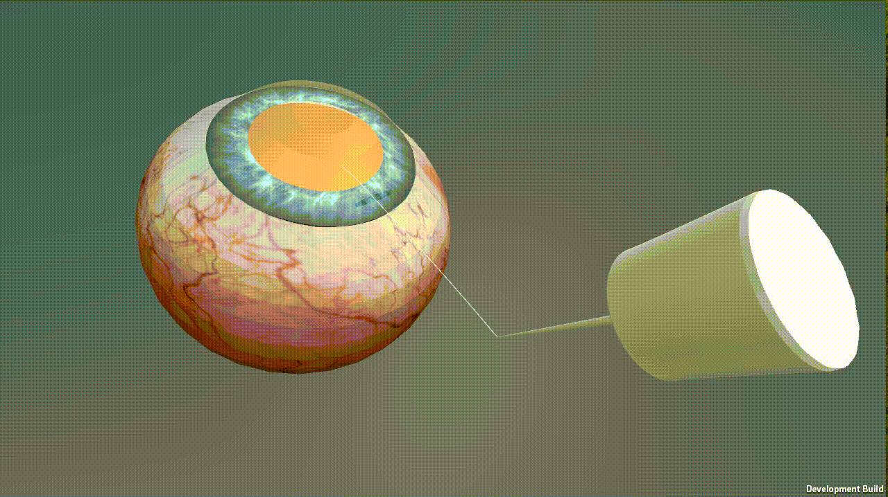

# Applying reinforcement learning in cataract surgery
A 3-D simulation environment is released here to train a reinforcement learning agent to perform surgical tasks. This
environment is based on Unity. The environment consists of an eye with one small incision and the capsulorhexis cystotome canula, as illustrated in the figure below. The eye elements modeled are: cornea, iris, capsule lens, transparent lens and sclera. At the moment, one task of cataract surgery has been modeled: capsulorhexis. The purpose of this task is to open the transparent capsule containing the diseased crystalline lens. The most commonly used technique to perform this task is a full-circle tear of the anterior face of the lens capsule. Then, the task in the environment is to have the tooltip makes a circular incision on the front side of the capsule lens.

# PPO agent

This project is based on [ml-agents](https://github.com/Unity-Technologies/ml-agents) library built by Unity. A PPO agent is trained to perform the capsulorhexis task. The model-free agent is trained with handcrafted dense rewards, guiding the policy optimisation towards more promising solutions. The reward strategy is based on two factors: the distance to the lens and the
incision shape done by the agent on the capsule lens. In other words, moving towards the lens gives the agent
positive rewards and moving away from the lens gives the agent negative rewards. In addition, circular incision on
the capsule lens gives positive rewards and non-circular one gives negative rewards.

The image above shows a reinforcement learning agent episode where the agent had access to the
3-D coordinates and motion vectors: the surgical instrument enters through a small incision visible on the right
side of the eye and makes a circular incision on the front side of the capsule. This episode shows that the agent is
able to incise a roughly circular piece of the lens capsule. This highly demonstrates the ability of a RL agent to
perform this surgical task.

# Installation
To avoid installation problems, we're using a singularity image built using ```DockerFile``` file in the project. Please contact us in order to share with the  the singularity images needed to launch the experiments.

### Dependencies
If you want to build your own singularity image you have to install:
- nvidia-docker
- singularity

Then, use the following commands:
```
*************** From docker file to singularity image*********************

# Start a docker registry or push the image on the online docker hub registry
docker pull registry (https://hub.docker.com/r/library/registry/)
docker run -d -p 5000:5000 --restart=always --name registry registry:2 (here is the source https://docs.docker.com/registry/deploying/#copy-an-image-from-docker-hub-to-your-registry)

#Build a docker image from a docker file
nvidia-docker build -t name_image -f ~/pathToDockerfile .

# Push local docker container to it
docker tag name_image localhost:5000/nameOfTag
docker push localhost:5000/nameOfTag

# Build singularity container
SINGULARITY_NOHTTPS=1 singularity build NameOfImage.simg docker://localhost:5000/nameOfTag:latest
```

# Usage
To launch a training, go to ```trainings/Env_vector_scratch/``` and use this command:
```
singularity exec --nv path_to_sing_image/mlagents_train.simg sh train.sh
```

To evalute the model, go to ```trainings/Env_vector_scratch/``` and use this command:
```
singularity exec --nv path_to_sing_image/mlagents_eval.simg sh eval.sh
```

# Notes to consider for Env_vector_scratch
- So far, the agent is trained using only PPO
- During training, the agent is fed the 3D coordinates of the capsulorhexis cystotome canula and its motion vectors.

# Copyright
Copyright © 2018-2019 [LaTIM U1101 Inserm](http://latim.univ-brest.fr/)


